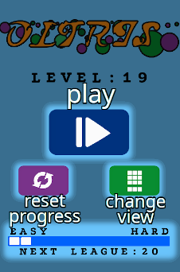
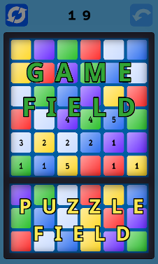
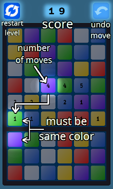
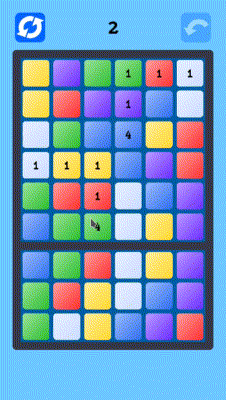
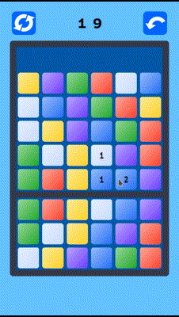

# Oltris (desktop)

Oltris is a simple, but challenging puzzle.

Pay attention! The first 10 levels provide the key for solving the whole game.

### About game

Main menu is self-explanatory:

Game screen is divided into two parts: Game field and Puzzle field:

  

The main goal of the game is to rearrange the blocks in the lower row of the Game field so that they match the color of the blocks in the upper row of the Puzzle field. Empty blocks cannot move. Blocks in the bottom line of the Game field must be empty (without moves). 

  

You can undo one move (blue button in the top right corner) or restart level (blue button in the top left corner). To return to main menu press Backspace.

### Installation

Download oltris-\*.jar from the root of repository and run it! 

Run from command line:
~~~
java -jar oltris-*.jar

~~~